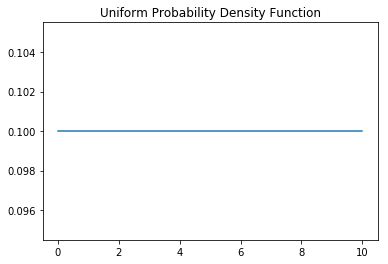

# The Uniform Probability Distribution

In the next few sections we will begin to investigate common probability distributions in order to better investigate random variables. This will allow us to choose appropriate mathematical models to reflect various real world observances. The most common of these probability distributions is the uniform distribution. Here, all values have equal probability of occurence. For example, rolling a dice is a discrete probability distribution with 6 possible outcomes (1-6). If it is a fair dice, then each of these outcomes has an equivalent probability of occuring and thus can be represented by a uniform distribution. Recall that this is a discrete case as there isn't a continuous variable that can take on values between 1 and 2 (or 2 and 3, 3 and 4, etc.).

In the continuous case, we define the density function of a uniform distributed random variable $y$ on the interval $(\theta_1, \theta_2)$ as:  
$f(y) = \frac{1}{\theta_1 - \theta_2}$ where $\theta_1 <= y <= \theta_2$  
and 0 everywhere else.  


```python
import numpy as np
import matplotlib.pyplot as plt
%matplotlib inline

def uniform_density(theta_1, theta_2):
    """Theta1 is the lower bound of possible outcomes.
       Theta2 is the upper bound of all possible outcomes.
       We are assuming that no other values outside of these bounds are possible,
       and that all possabilities within those bounds have equal probability of occuring.
    """
    prob = 1/(theta_2 - theta_1)
    return prob

theta_1 = 0
theta_2 = 10
y = np.linspace(start=theta_1, stop=theta_2, num=10**3)
plt.plot(y, [uniform_density(theta_1, theta_2) for yi in y])
plt.title('Uniform Probability Density Function')

```


    Text(0.5,1,'Uniform Probability Density Function')





# Telephone Calls
A telephone line was overloaded for 30 seconds in a minute interval. If you called during this minute, what was the chance you got connected?


```python
#Your code here
```

# Landing
A parachuter lands at a random point between two markers A, and B. What is the probability that they are closer to A?


```python
#Your code here
```

# Landing 2
What is the probability that they are twice as close to A as to B?


```python
# Your code here
```

# Error
Sometimes error is modelled using a normal distribution. Other times a uniform distribution is used. 
In the case of cars, your spedometer is required to be accurate within 2.5% of the actual measurement.
If your spedometer reads 70mph but and has an accuracy of +-2.5% with the errors uniformly distributed, what is the probability that you are actually driving slower then 70mph?


```python
#Your code here
```

# Error 2
Using the same problem context from above, what's the probability that you are driving 69mph or slower?


```python
#Your code here
```
